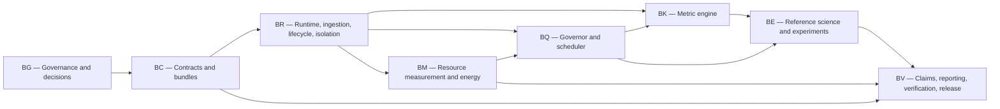

# BONSAI — Canonical Plan / Sequential Prompt Roster (PSPR)

**Benchmark for Online, Nonstationary, Single-pass Agent Intelligence**

Version: 0.1  
Date: 2026-07-18  
Status: **APPROVED v0.1 — NOT AUTHORIZED FOR EXECUTION**  
Initiative: Build an algorithm-neutral measurement and resource-governance instrument for OaK-style discovery cycles.  
Authoritative working location: `C:\Users\17076\Documents\Reinforcement Learning Project`  
Proposed independent repository root: `C:\Users\17076\Documents\Reinforcement Learning Project`  

> Drafting or approving the research charter is not authorization to execute this roster. No implementation prompt may begin until the user says `run it STS` or explicitly approves named milestones, phases, or prompt IDs.

---

## 0. Governance and source of truth

### 0.1 Mission and implementation boundary

BONSAI is the independent observer, evidence producer, and external resource-governance authority. It is not the OaK implementation, must not silently choose the evaluated agent's learning algorithm, and must not describe any BONSAI reference agent as an implementation of unpublished Oak Lab algorithms.

The implementation objective is:

> Under fixed and explicitly measured compute, memory, storage, latency, and energy constraints, determine whether a single-pass online agent grows reusable state and temporal abstractions whose downstream planning and behavioral benefit exceeds their acquisition and maintenance cost.

Instrument completion and evaluated-agent success are separate outcomes. BONSAI may be complete even when every evaluated discovery cycle fails C4 or C5.

### 0.2 Source-of-truth hierarchy

When sources conflict, use this order:

1. The user's current instruction and any explicitly approved PSPR addendum.
2. `BONSAI-RESEARCH-CHARTER.md` for scientific intent, scope, exclusions, measurement obligations, and claim boundaries.
3. `OAK-EVIDENCE-AND-TRACEABILITY.md` for the boundary between published OaK claims, primary-source support, and BONSAI inference.
4. This PSPR, after approval, for implementation order, prompt scope, gates, milestones, and settled defaults.
5. Approved architecture decision records (ADRs), versioned schemas, and metric specifications created by this roster.
6. The BONSAI DEVLOG and verification log for executed history and evidence identity.
7. Code, tests, generated documentation, and result bundles at the recorded source revision.

History must not be silently rewritten. A changed decision requires a dated ADR or PSPR addendum that identifies what it supersedes, why, and which prompts or evidence become stale.

### 0.3 Current-state truth

At drafting time:

- The four approved charter-package documents are the only substantive project files.
- Implementation has not started.
- The local `.git` directory is empty and does not establish an independent repository. Unqualified Git commands walk upward to an unrelated repository at `C:\Users\17076`; that parent repository is out of scope.
- No BONSAI remote, license, dependency lock, CI system, code, test, evidence bundle, or reusable implementation exists yet.
- Therefore, reuse currently consists of approved requirements, scientific references, standard formats, and the user's PSPR governance pattern—not local BONSAI code.

Repository initialization, remote creation, publication, and license choice remain decision-controlled actions in BG-01 through BG-04.

### 0.4 Authorization and execution discipline

- PSPR review or revision is not STS authorization.
- Execute only approved prompt IDs and their dependencies.
- One prompt normally maps to one focused commit. A bundle is allowed only when splitting would make either commit invalid; the DEVLOG must explain the bundle.
- Use an isolated worktree per concurrent implementation session after an independent repository exists. Sessions must never share a Git index.
- Do not mark a prompt complete or commit it until its prescribed gate passes.
- A failed or indeterminate scientific result is recordable evidence, not a reason to weaken a gate.
- External publication, remote creation, credential use, hardware-probe installation, privileged collectors, and destructive filesystem actions require their own explicit authority even during an approved implementation phase.

### 0.5 Prompt status and change control

Prompt checkboxes use:

- `[ ]` not started;
- `[~]` executing but not gated;
- `[x]` gate passed, DEVLOG entry complete, and commit recorded;
- `[!]` blocked with the blocker and evidence recorded;
- `[-]` superseded by a named, dated addendum.

The approved PSPR remains historical. Execution status may be appended, but prompt substance is changed only through a reviewable addendum.

### 0.6 Universal verification gate

After the scaffold prompts create the commands, every implementation prompt must pass the applicable subset of:

1. `cargo fmt --all --check`.
2. `cargo clippy --workspace --all-targets --all-features -- -D warnings`.
3. `cargo test --workspace --all-features`.
4. `uv run ruff check .`, `uv run pyright`, and `uv run pytest` for Python/reference-science changes.
5. `cargo xtask schema-check` for schema, manifest, event, result-bundle, or API changes.
6. `cargo xtask evidence-check` for evidence-producing changes.
7. Platform-specific integration tests on the platform actually claimed; simulated backends do not close a physical-backend gate.
8. No new ignored, quarantined, or expected-failure test without an explicit risk-register entry and user-approved waiver.
9. No mock-only closure for resource enforcement, process isolation, replay isolation, energy/counter collection, tamper detection, or platform behavior. Each such prompt needs at least one live OS or physical-host test appropriate to its claim.
10. A prompt-local verification record containing exact command, start/end time, exit code, source revision, platform fingerprint, and artifact hashes.

Until the aggregate commands exist, the prompt's own bootstrap gate is authoritative and must be recorded verbatim.

### 0.7 Execution records

Execution creates and maintains:

- `docs/sessions/BONSAI-DEVLOG.md` — prompt ID, objective, files changed, decisions, verification summary, evidence paths, commit SHA, and remaining risks.
- `docs/verification/BONSAI-VERIFICATION-LOG.md` — exact commands, environment fingerprint, timestamps, exit status, output artifact hashes, CI run links, and physical-host attestations.
- `docs/governance/RISK-AND-BLOCKER-REGISTER.md` — owner, trigger, impact, mitigation, status, and affected prompt IDs.
- `docs/governance/PARKED-SCOPE-LEDGER.md` — excluded item, rationale, revival condition, and required authorization.
- `docs/governance/CLAIM-TO-EVIDENCE-MATRIX.md` — claim criterion, metric version, scenarios, comparators, seeds, evidence level, verdict, and bundle identities.

Raw high-volume telemetry is not committed by default. Small deterministic fixtures, schemas, manifests, expected summaries, and signed evidence indexes may be committed. The DEVLOG must point to retained large artifacts.

---

## 1. Decisions proposed for PSPR approval

The user approved this PSPR in its entirety on 2026-07-18, settling these defaults for v0.1. Any later override that changes dependencies or acceptance logic requires a PSPR addendum before the affected STS execution.

| ID | Proposed default | Override point / consequence |
|---|---|---|
| D-01 | Create a new independent BONSAI repository at the current project root; never attach it to the unrelated parent repository. | A different root or monorepo changes all file paths, worktree policy, release identity, and evidence provenance. |
| D-02 | Rust stable is the primary runtime for contracts, ingestion, measurement, governance, metrics, CLI, and report generation. Python 3.12+ is a separately locked reference-science and adapter package. | Python-only simplifies experiments but weakens native resource control; Rust-only makes scientific adapters and comparison reuse harder. |
| D-03 | Evaluated agents and environments run in child processes behind a versioned, length-delimited Protobuf adapter protocol over inherited stdin/stdout. The observer/governor owns process launch and the only telemetry write path. | In-process plugins reduce overhead but weaken fault and replay isolation. Network RPC adds port, authentication, and firewall surface. |
| D-04 | Core storage is combined: immutable canonical JSON manifests; append-only framed Protobuf event segments; content-addressed blobs; a portable SQLite metadata/index database; derived Arrow/Parquet analytical tables. | A single database makes live mutation easier but weakens append-only audit semantics; files-only make indexing and recovery harder. |
| D-05 | Schema evolution uses explicit schema epochs, Protobuf field-number reservation, additive minor evolution, migration fixtures, and JSON Schema 2020-12 for JSON artifacts. Breaking changes require a major epoch and migrator. | Choosing another IDL or permitting implicit migrations changes every adapter and bundle gate. |
| D-06 | Static, self-contained HTML reports are the publication artifact. A local, read-only dashboard/bundle viewer is also shipped; it never becomes required for canonical runs. | A dashboard-only design harms archival reproducibility; static-only slows interactive analysis. |
| D-07 | Package the Rust CLI as native binaries for required host targets, the Python adapters as wheels plus source distributions, and the entire repository as source. OCI images are convenience artifacts, never a core-run requirement. | Binary-only or container-only release conflicts with auditability or local/no-cloud obligations. |
| D-08 | Require lockfiles and offline-restorable dependency archives for acceptance; aim for reproducible bit-for-bit artifacts where the toolchain permits and otherwise record normalized provenance differences. | Relaxing offline restoration weakens long-term reproducibility. |
| D-09 | Proposed license: dual Apache-2.0 OR MIT. Repository remains private/local through the final evidence audit; public release is a separate explicit publication decision. | License and visibility must be chosen before accepting external contributions or publishing artifacts. |
| D-10 | Required physical-host targets for first release: Windows 11 x86_64/MSVC, macOS on Apple silicon, and x86_64 Linux with cgroup v2. CI additionally covers x86_64 macOS when hosted capacity is available. ARM64 Windows/Linux are portability targets, not first-release physical-host gates. | Expanding the physical matrix increases backend and release work; reducing it violates first-class OS coverage. |
| D-11 | Store monotonic duration values as integer nanoseconds plus measured effective clock resolution. Required-event loss is zero. Reference-run instrumentation overhead ceiling: upper bound of the paired 95% CI is at most 5% for median throughput and at most 10% for p95 action latency. | Different ceilings materially change sampling, storage, and metric availability. |
| D-12 | Canonical compute proxies when direct counters are unavailable: process CPU time, monotonic wall time, environment steps, agent updates, parameter touches, event/work-item counts, model calls, planning backups, and declared estimated operations. Missing counters are `unavailable`, never zero. | Adding FLOP claims without a declared estimator makes matched-budget comparisons invalid. |
| D-13 | First-release accelerator support: NVIDIA through NVML where present, plus Apple integrated-GPU/system evidence only through a documented supported collector. AMD/Intel discrete accelerator collectors are parked; their devices still run at E0 with non-energy proxies. | Adding vendors requires backend, calibration, and physical-host evidence before claims. |
| D-14 | Energy claim rule: E0 permits no energy claim; E1 permits qualified within-machine estimates; E2 is required for cross-configuration energy comparisons; E3 is required only for laboratory-grade power claims. A C5 verdict that asserts total resource positivity requires at least E2 on the claiming platform. | Lowering the tier risks false resource-positive claims; requiring E3 universally would block ordinary hosts. |
| D-15 | Statistics: smoke = 1 deterministic seed; conformance = 5 paired seeds; C2/C3 candidate claims = at least 20 paired seeds; C4/C5 = at least 30 paired seeds across at least 3 relevant scenario families. Use preregistered primary outcomes, paired 95% bootstrap intervals, effect sizes, and Holm correction for a declared comparison family. | Lower counts may be approved only by a power analysis and must not inherit stronger claim eligibility. |
| D-16 | Resource profiles: Smoke S = 2,000 steps/1 seed/2 min wall/1 GiB agent RSS/64 MiB agent storage/512 MiB observer output; Conformance C = 100,000 steps/5 seeds/60 min per seed/2 GiB RSS/256 MiB agent storage/5 GiB observer output; Acceptance A = 1,000,000 steps/30 seeds/8 h per seed/4 GiB RSS/1 GiB agent storage/25 GiB observer output; Long L = at least 72 h and 10 million steps on 3 paired seeds per required physical OS. Per-step CPU and action deadlines are scenario-manifest fields and must be matched within a comparison. | Pilot evidence may justify a reviewed amendment before the first C or A run; execution must not silently resize profiles. |
| D-17 | Reference science uses a clearly named **BONSAI Reference Discovery Cycle v1 (BRDC-1)**: tabular/linear public ingredients, reward-respecting feature-attainment subproblems, options, learned option models, planning, and explicit backward utility credit. It is STOMP/OaK-style, not an Oak Lab implementation. | A neural or unpublished algorithm is not needed to validate the instrument and would blur the claim boundary. |
| D-18 | Initial scenarios are BONSAI-owned deterministic diagnostic worlds plus procedurally enlarged big-world variants for all ten charter families. The adapter protocol also supports external Gymnasium-compatible environments, but Gymnasium is not a core dependency. | External-only environments reduce causal control; custom-only interfaces reduce reuse. |
| D-19 | A planning backup is **consequential** when, under a recorded paired counterfactual with identical pre-backup state and random draws, omitting that backup changes a subsequent policy distribution beyond declared epsilon or changes an action within the attribution horizon. Approximate influence estimates must be labeled and calibrated against exact tabular counterfactuals. | A looser “value changed” definition would count backups that never affect behavior. |
| D-20 | Initial utility evidence hierarchy: exact leave-one-artifact-out or omit-one-event counterfactuals in diagnostic worlds; matched ablations for scenario-level claims; calibrated consumer-credit/influence estimates for scalable online curation. Proxy utility alone cannot establish C3. | Requiring exact counterfactuals everywhere is computationally prohibitive; accepting only proxy credit is scientifically weak. |
| D-21 | Hostile native-code sandboxing is excluded from v1. Process isolation, bounded messages, OS resource controls, least-privilege launch, and fail-closed termination protect the instrument from faulty adapters but are not represented as a security sandbox. | If hostile-code evaluation is required, a new threat model and containment milestone must precede running it. |

### 1.1 Rationale anchors

- Rust publishes supported Windows, macOS, and Linux host targets and is suitable for the native control plane: <https://doc.rust-lang.org/rustc/platform-support.html>.
- Protobuf supplies a language-neutral wire contract and documented compatibility constraints: <https://protobuf.dev/programming-guides/proto3/>.
- SQLite is explicitly suitable as a portable application-file container: <https://www.sqlite.org/appfileformat.html>.
- Arrow defines a language-agnostic columnar analytical format and IPC representation: <https://arrow.apache.org/docs/format/Columnar.html>.
- Windows Job Objects can group, account for, limit, and terminate process trees: <https://learn.microsoft.com/en-us/windows/win32/procthread/job-objects>.
- Linux cgroup v2 defines hierarchical CPU, memory, I/O, and process controls: <https://docs.kernel.org/admin-guide/cgroup-v2.html>.
- Linux powercap exposes energy counters and their units where supported: <https://kernel.org/doc/html/next/power/powercap/powercap.html>.
- NVIDIA NVML exposes feature-detected device measurement with explicit unsupported/permission/error states: <https://docs.nvidia.com/deploy/nvml-api/group__nvmlDeviceQueries.html>.

These sources justify seams and spikes, not blanket availability. Platform prompts must detect actual capabilities and record unavailable states.

---

## 2. Architecture and evidence model

### 2.1 Proposed component boundaries

```text
experiment manifest
        |
        v
BONSAI supervisor/governor ----> platform resource backend
        |                                  |
        | framed adapter protocol          | samples/violations
        v                                  v
agent process <---- authorized stream ---- event ingestor
        |                                  |
        v                                  v
environment process                 append-only event segments
                                           |
                           +---------------+----------------+
                           v                                v
                    metric/claim engine              bundle index + hashes
                           |                                |
                           +---------------+----------------+
                                           v
                              static report / local viewer
```

The agent never receives observer-retained events, metric tables, lineage history, comparator results, or report outputs. Any feedback returned to the agent must be an explicitly authorized online signal defined in the adapter contract and counted against resource budgets.

### 2.2 Proposed repository layout

```text
/
  Cargo.toml
  Cargo.lock
  rust-toolchain.toml
  pyproject.toml
  uv.lock
  crates/
    bonsai-contracts/
    bonsai-bundle/
    bonsai-ingest/
    bonsai-lineage/
    bonsai-platform/
    bonsai-governor/
    bonsai-metrics/
    bonsai-claims/
    bonsai-report/
    bonsai-cli/
    bonsai-xtask/
  proto/
  schemas/
  python/bonsai-reference/
  scenarios/
  adapters/
  docs/architecture/adr/
  docs/governance/
  docs/metrics/
  docs/scenarios/
  docs/sessions/
  docs/verification/
  fixtures/
  tests/
  evidence/
```

This is a planning target. Scaffold prompts may refine crate boundaries through an ADR, but may not collapse observer, agent, and governor trust boundaries without PSPR review.

### 2.3 Result-bundle minimum structure

Every reportable run produces an immutable bundle containing at least:

```text
bundle/
  manifest.json
  inventory.json
  track.json
  resource-policy.json
  availability.json
  events/segment-*.pb
  index.sqlite
  metrics/*.parquet
  lineage/*.parquet
  decisions/*.jsonl
  report/index.html
  failures.json
  claims.json
  hashes.json
  signature.json          # optional until signing prompt; availability explicit
```

The manifest records the source revision and dirty state. Every derived artifact records its input hashes, schema/metric versions, and producer version. A bundle is invalid if required files are missing, a hash fails, track classification is ambiguous, or an unavailable metric is represented as zero.

### 2.4 Track separation invariant

Track A, B, C, and D use distinct manifest enums, bundle namespaces, report labels, and claim eligibility. A process that receives observer history, stored transitions, privileged state, human labels, or offline updates cannot emit a Track A bundle. Classification is derived from enforceable runtime facts, not only an adapter's self-report. Any ambiguity yields `INDETERMINATE_TRACK` and blocks C2–C5.

---

## 3. Milestones and staged usability

Milestones are independently approvable. Each is a vertical slice with a usable artifact, not merely a horizontal infrastructure layer.

| Milestone | Outcome | Prompt cut | Milestone gate |
|---|---|---|---|
| M0 — Governed foundation | Independent repository identity, settled ADRs, locked toolchains, logs, risks, and frozen v1 naming/units. | BG-01–BG-10 | Source-of-truth audit passes; user decisions recorded; clean baseline; no implementation claim. |
| M1 — Auditable heartbeat | A primitive control runs one deterministic Track A scenario under a basic external budget and emits a valid C0/C1-capable bundle and static report on all three CI OS families. | BC-01–BC-12, BR-01–BR-06, BM-01–BM-04, BQ-01–BQ-04, BK-01–BK-03, BE-01–BE-03, BV-01–BV-03 | Same manifest produces schema-valid bundles on Windows/macOS/Linux; no hidden replay; budget decisions and overhead shown. |
| M2 — Useful-abstraction slice | BRDC-1 produces traceable feature → subproblem → option → model → planning artifacts with backward utility credit and exact diagnostic ablations. | BR-07–BR-10, BQ-05–BQ-06, BK-04–BK-13, BE-04–BE-09, BV-04–BV-05 | At least three diagnostic families run; C3 is pass/fail/indeterminate from machine rules; no OaK reproduction claim. |
| M3 — Cross-platform governed science | Live OS resource backends, energy tiers, dense/event-driven schedulers, all comparators, all scenario families, matched-budget orchestration, and cross-platform equivalence. | BM-05–BM-14, BQ-07–BQ-12, BK-14, BE-10–BE-16, BV-06–BV-10 | Required physical-host conformance gates pass; platform availability differs honestly; C4 experiments can run but need not pass. |
| M4 — Acceptance and release candidate | Security/integrity hardening, instrumentation-overhead closure, long-duration runs, full claim audit, offline restore, documentation, and release artifacts. | BV-11–BV-16 plus all prior prompts | Instrument completion criteria pass; 72-hour evidence exists on required physical hosts; publication remains separately authorized. |

M1–M4 may be approved independently only with all prerequisite prompts. A milestone approval never authorizes external publication.

---

## 4. Prompt dependency graph



Dependencies shown per prompt override this phase summary. If two prompts are independent, they may run in separate worktrees only after their shared dependencies are committed.

---

## 5. Sequential prompt roster

### Phase BG — Repository, governance, and settled decisions

- [x] **BG-01 — Establish independent repository identity.** **Depends:** PSPR approval and STS authorization. **Files:** repository metadata, root `README.md`. **Objective:** verify the empty local `.git`, initialize only the project root as a new repository, record default branch and clean baseline, and prove Git no longer resolves to `C:\Users\17076`. **Excludes:** remote creation, publication, or importing parent history. **Gate:** `git rev-parse --show-toplevel` equals the authoritative root; initial status is recorded; parent paths are absent from the index.
- [x] **BG-02 — Freeze source-of-truth governance.** **Depends:** BG-01. **Files:** `docs/governance/SOURCE-OF-TRUTH.md`, root `README.md`. **Objective:** encode section 0's hierarchy, authorization boundary, addendum policy, and prompt-status semantics. **Excludes:** changing charter science. **Gate:** document links resolve and an automated docs check confirms the STS warning exists in the root README and PSPR.
- [x] **BG-03 — Adjudicate D-01 through D-21.** **Depends:** BG-01. **Files:** `docs/architecture/adr/0001-*.md` through the required ADR set. **Objective:** record each approved default, rejected alternative, consequences, owner, and supersession rule. **Excludes:** implementing the choices. **Gate:** ADR index maps every D-ID to exactly one accepted or explicitly unresolved decision; unresolved material decisions block dependent prompts.
- [x] **BG-04 — Set license, visibility, and publication policy.** **Depends:** BG-03. **Files:** license files, `CONTRIBUTING.md`, `SECURITY.md`, `docs/governance/PUBLICATION-POLICY.md`. **Objective:** enact the approved D-09 choice and separate local/private development from external publication. **Excludes:** creating or pushing a remote. **Gate:** license scanner identifies only the approved license; publication policy requires explicit authorization and secret/redaction review.
- [x] **BG-05 — Scaffold Rust and Python workspaces.** **Depends:** BG-03, BG-04. **Files:** `Cargo.toml`, `Cargo.lock`, `rust-toolchain.toml`, `pyproject.toml`, `uv.lock`, minimal package roots. **Objective:** create empty compile/test surfaces with pinned toolchain policy. **Excludes:** domain behavior. **Gate:** universal format/lint/type/test commands run green from a clean checkout on Windows; lockfiles are committed.
- [x] **BG-06 — Create DEVLOG and verification-log machinery.** **Depends:** BG-02, BG-05. **Files:** log templates, `crates/bonsai-xtask`. **Objective:** define append-only execution records and an `xtask` command that captures command, platform, revision, dirty state, times, exit code, and hashes. **Excludes:** falsifying past execution entries. **Gate:** a deliberate passing and failing fixture produce complete, distinguishable records without leaking environment secrets.
- [x] **BG-07 — Create risk, blocker, and parked-scope ledgers.** **Depends:** BG-02. **Files:** three governance ledgers. **Objective:** seed them from sections 9 and 10, assign review cadence, and link prompt IDs. **Excludes:** reviving parked work. **Gate:** schema validation catches missing owner/status/revival criteria; every initial risk and parked item has an ID.
- [x] **BG-08 — Freeze canonical terminology, identifiers, and units.** **Depends:** BG-03. **Files:** `docs/governance/TERMINOLOGY-AND-UNITS.md`, machine-readable registry under `schemas/registry/`. **Objective:** define run, stream, transition, event, work item, artifact types, lineage, consumer, track, budget scopes, claim states, SI/IEC units, missingness, precision, and clock semantics. **Excludes:** metric formulas. **Gate:** duplicate or ambiguous names fail registry validation; all numeric fields require unit and representation.
- [x] **BG-09 — Establish CI topology without claiming physical acceptance.** **Depends:** BG-05, BG-06. **Files:** CI workflows and `docs/verification/TEST-MATRIX.md`. **Objective:** run baseline checks on Windows, macOS, and Linux; label CI evidence separately from physical-host evidence. **Excludes:** treating hosted runners as energy or long-duration proof. **Gate:** no-op change exercises all required jobs; generated evidence identifies runner virtualization and evidence class.
- [x] **BG-10 — Baseline and governance review checkpoint.** **Depends:** BG-01–BG-09. **Files:** DEVLOG, verification log, ADR index. **Objective:** reconcile current files, decisions, risks, gates, and milestone cuts before contract code. **Excludes:** BC work. **Gate:** M0 checklist passes, clean status and commit identity are recorded, and the user-approved execution scope still covers the next prompt.

### Phase BC — Contracts, schema evolution, and result bundles

- [x] **BC-01 — Define schema-version policy and compatibility harness.** **Depends:** BG-08, BG-10. **Files:** `proto/README.md`, `schemas/README.md`, schema-check tooling. **Objective:** implement epoch/minor rules, field reservation, canonical JSON rules, compatibility fixtures, and migration obligations. **Excludes:** domain messages. **Gate:** additive fixture passes; field renumbering, field reuse, silent unit change, and unversioned JSON fail.
- [x] **BC-02 — Define universal event envelope.** **Depends:** BC-01. **Files:** `proto/bonsai/event/v1/envelope.proto`, contracts crate. **Objective:** specify run ID, source ID, per-source sequence, causal parents, monotonic and optional wall timestamps, event type, schema version, payload hash, availability, and precision. **Excludes:** assuming global wall-clock order. **Gate:** Rust/Python round trip; unknown fields survive the supported relay path; invalid IDs/times fail.
- [x] **BC-03 — Define experiment manifest schema.** **Depends:** BC-01, BG-08. **Files:** `schemas/experiment-manifest-v1.json`. **Objective:** encode source identity, dirty state, adapter/environment config, seeds, track declaration, resource profile, metrics, scenario, expected counters, and publication eligibility. **Excludes:** mutable defaults at runtime. **Gate:** canonical serialization hash is stable across OS; omitted replay/resource/seed declarations fail.
- [x] **BC-04 — Define platform and dependency inventory.** **Depends:** BC-01. **Files:** inventory schema and collectors' interface types. **Objective:** record OS/build/architecture, CPU/GPU, memory, clocks, drivers, runtime/compiler, dependency locks, privilege state, collectors, thermal/power state, and sanitized machine identity. **Excludes:** secrets and unnecessary serial numbers. **Gate:** redaction fixtures remove user paths, tokens, hostnames, and device serials while retaining reproducibility fields.
- [x] **BC-05 — Define track and replay declarations.** **Depends:** BC-03. **Files:** track schema and eligibility rules. **Objective:** make A/B/C/D mutually exclusive and derive classification from runtime capabilities, message flow, retained state, and privileged inputs. **Excludes:** self-attested Track A. **Gate:** hidden replay, offline update, observer-data access, or privileged-state fixtures yield the correct comparator or `INDETERMINATE_TRACK`.
- [x] **BC-06 — Define resource policy and governor-decision schemas.** **Depends:** BC-03, BG-08. **Files:** resource-policy JSON schema, Protobuf decision events. **Objective:** represent per-event, per-step, rolling-window, lifetime, work-class allocation, soft/hard limits, measured/estimated basis, and admit/defer/throttle/reject/terminate outcomes. **Excludes:** backend enforcement. **Gate:** every decision is reconstructible from policy version, observed state, requested work, and reason code.
- [x] **BC-07 — Define cognitive-artifact and lineage schemas.** **Depends:** BC-02, BG-08. **Files:** artifact/lineage Protobuf and registry entries. **Objective:** cover feature, subproblem, option, model, planner, policy, value function, stable identity, parents, consumers, birth/revision/retirement, cost, utility history, and disposition. **Excludes:** prescribing learning internals. **Gate:** lifecycle state-machine property tests reject orphan revisions, cycles where forbidden, missing provenance, and resurrection after terminal disposition without a new identity.
- [x] **BC-08 — Define metric and claim-result schemas.** **Depends:** BC-01, BG-08. **Files:** metric-spec, estimate, uncertainty, and claim verdict schemas. **Objective:** require formula/version/unit/direction, population, window, estimator, missingness, precision, uncertainty, inputs, and pass/fail/indeterminate reasons. **Excludes:** metric implementation. **Gate:** a scalar without unit/provenance and a verdict without criterion/evidence fail validation.
- [x] **BC-09 — Implement append-only event segment format.** **Depends:** BC-02. **Files:** `bonsai-bundle`, fixtures. **Objective:** write length-delimited frames with segment headers, checksums, monotonic segment sequence, crash-safe finalization, and bounded frame sizes. **Excludes:** arbitrary mutation or in-place compaction. **Gate:** truncation, checksum corruption, oversized frame, duplicate sequence, and recovery fixtures yield deterministic explicit outcomes.
- [x] **BC-10 — Implement portable bundle index and content-addressed blobs.** **Depends:** BC-03–BC-09. **Files:** SQLite schema/migrations, blob store. **Objective:** index immutable event segments and derived artifacts without making SQLite the authoritative event history. **Excludes:** network database and agent access. **Gate:** rebuild index from bundle files; reject hash collision/mismatch and path traversal; bundle opens read-only on all three OS families.
- [x] **BC-11 — Implement Arrow/Parquet derivation contract.** **Depends:** BC-08–BC-10. **Files:** analytical schemas, derivation metadata. **Objective:** materialize event, metric, lineage, and decision tables with source hashes and deterministic column semantics. **Excludes:** treating derived tables as raw truth. **Gate:** regeneration from identical inputs is semantically identical; stale or wrong-input tables are detected.
- [x] **BC-12 — Bundle validator and migration conformance.** **Depends:** BC-01–BC-11. **Files:** CLI validator, v0/v1/forward fixtures. **Objective:** produce a single machine-readable validity report covering schema, hashes, track, inventory, resource policy, failures, metric provenance, and migrations. **Excludes:** claim adjudication. **Gate:** corpus includes valid, old-migratable, forward-readable, corrupt, ambiguous-track, unavailable-counter, and tampered bundles with exact expected verdicts.

### Phase BR — Runtime, ingestion, ordering, lifecycle, and isolation

- [x] **BR-01 — Specify adapter protocol and capability handshake.** **Depends:** BC-02–BC-07. **Files:** adapter Protobuf, `docs/architecture/ADAPTER-PROTOCOL.md`. **Objective:** define start/configure/reset/step/work/feedback/stop, capabilities, schema negotiation, deadlines, deterministic seed handling, and explicit replay/privilege flags. **Excludes:** network transport and algorithm APIs. **Gate:** state-machine model rejects out-of-order calls, version mismatch, undeclared capability changes, and post-stop events.
- [x] **BR-02 — Implement bounded framed process transport.** **Depends:** BR-01. **Files:** supervisor transport and Python adapter runtime. **Objective:** launch child processes with inherited handles, bounded frames, independent stdout protocol/stderr logs, backpressure, timeouts, and clean shutdown. **Excludes:** hostile-code sandbox claim. **Gate:** Rust↔Python conformance on all CI OS; malformed, partial, stalled, and flood senders are contained and recorded.
- [x] **BR-03 — Implement event ingestion validation.** **Depends:** BC-09, BR-02. **Files:** `bonsai-ingest`. **Objective:** validate schemas, IDs, size/rate bounds, source authorization, hashes, and lifecycle preconditions before append. **Excludes:** silently repairing invalid evidence. **Gate:** property/fuzz corpus never panics or appends invalid events; rejection emits bounded observer evidence.
- [x] **BR-04 — Define and implement ordering semantics.** **Depends:** BR-03. **Files:** ordering engine and specification. **Objective:** use per-source sequences and causal edges; derive partial order; classify late, duplicate, missing-parent, concurrent, and clock-regression events. **Excludes:** a fabricated total order based on wall time. **Gate:** deterministic concurrency fixtures produce the same partial-order classes across OS and randomized arrival order.
- [x] **BR-05 — Implement run lifecycle and failure recovery.** **Depends:** BR-02–BR-04, BC-12. **Files:** supervisor lifecycle. **Objective:** cover created/running/degraded/terminating/completed/failed/recovered; close segments and preserve evidence after crashes. **Excludes:** resuming agent learning from observer telemetry. **Gate:** kill-at-every-boundary tests yield valid failed/recovered bundles without double-consuming a transition.
- [x] **BR-06 — Enforce agent/observer data isolation.** **Depends:** BR-02, BC-05. **Files:** launch policy, filesystem layout, capability audit. **Objective:** give the agent only manifest-authorized inputs and an isolated writable area; keep telemetry/index/report paths out of handles, args, env, and protocol. **Excludes:** adversarial OS sandbox. **Gate:** inspection adapter cannot discover/read observer files through granted interfaces; deliberate access request forces non-Track-A classification and denial evidence.
- [ ] **BR-07 — Implement artifact lifecycle registry.** **Depends:** BC-07, BR-03–BR-04. **Files:** `bonsai-lineage`. **Objective:** maintain immutable artifact versions, lifecycle transitions, parents, consumers, cost and disposition. **Excludes:** deciding artifact utility. **Gate:** model-based tests cover every valid/invalid transition and deterministic reconstruction from events.
- [ ] **BR-08 — Implement lineage graph and causal queries.** **Depends:** BR-07, BC-11. **Files:** lineage graph/query layer. **Objective:** answer ancestry, descendants, active consumers, utility sources, revision semantics, and cost rollups without mutating evidence. **Excludes:** inferring causality from correlation. **Gate:** known graphs return exact queries; cycle, dangling-edge, duplicate-ID, and representation-change fixtures are explicit failures.
- [ ] **BR-09 — Implement observer-only replay and analysis classification.** **Depends:** BR-05–BR-08. **Files:** replay analyzer. **Objective:** replay telemetry into metrics/reports deterministically while cryptographically and structurally preventing return to the agent. **Excludes:** agent training replay. **Gate:** observer replay reproduces derived tables; any route from replay output to agent input is rejected and track eligibility becomes indeterminate.
- [ ] **BR-10 — Runtime conformance suite.** **Depends:** BR-01–BR-09. **Files:** adapter certification fixtures and docs. **Objective:** certify third-party adapters for protocol, isolation declaration, ordering, lifecycle, determinism, timeouts, and classification. **Excludes:** certifying scientific quality. **Gate:** reference good/bad adapters receive expected machine verdicts on Windows/macOS/Linux.

### Phase BM — Platform-neutral and platform-specific resource measurement

- [x] **BM-01 — Define resource sample interface and availability model.** **Depends:** BC-04, BC-06, BR-05. **Files:** `bonsai-platform` traits/types. **Objective:** unify wall/monotonic time, CPU, memory, storage, I/O, process tree, accelerator, operations, and energy with value/unit/scope/provenance/resolution/uncertainty/status. **Excludes:** pretending unsupported counters are portable. **Gate:** every backend must return measured/estimated/unavailable/error; zero is distinct from unavailable.
- [x] **BM-02 — Clock calibration and deadline basis.** **Depends:** BM-01. **Files:** clock backend/calibration report. **Objective:** measure effective resolution, monotonicity, drift against optional wall clock, call overhead, suspend behavior, and cross-process timestamp limits. **Excludes:** using wall time for durations. **Gate:** resolution and overhead fixtures pass on all CI OS; regressions and suspend produce explicit annotations.
- [x] **BM-03 — Portable process, memory, storage, and operation accounting.** **Depends:** BM-01, BR-05. **Files:** portable collector, agent-work API. **Objective:** collect process-tree CPU time, RSS/commit where comparable, agent-owned storage, observer storage, environment steps, updates, touches, work items, model calls, and backups. **Excludes:** equating RSS and committed memory across OS. **Gate:** calibrated workload yields bounded error and correctly scoped child-process totals; unit semantics are platform-qualified.
- [x] **BM-04 — Measurement calibration harness.** **Depends:** BM-02–BM-03. **Files:** calibration workloads and reports. **Objective:** generate known CPU, allocation, storage, I/O, and event loads; quantify sampling error and observer cost. **Excludes:** scientific-agent claims. **Gate:** each counter's observed error, resolution, and coverage is recorded; unsupported or unstable counters fail closed for dependent claims.
- [ ] **BM-05 — Windows measurement backend.** **Depends:** BM-04. **Files:** Windows backend. **Objective:** use supported Win32 process/job accounting for process trees, CPU, committed memory, I/O, lifecycle, and limit notifications with capability detection. **Excludes:** undocumented energy APIs as normative evidence. **Gate:** live Windows physical-host tests compare against controlled workloads and Job Object accounting; escape/child-process cases are covered.
- [ ] **BM-06 — Windows enforcement primitive spike.** **Depends:** BM-05, D-21 decision. **Files:** ADR and Job Object control implementation. **Objective:** verify hard/notification semantics for CPU, memory, process count, I/O where supported, and kill-on-governor-close. **Excludes:** security sandbox claim. **Gate:** each supported hard limit is crossed intentionally and produces bounded overshoot plus recorded termination; unsupported limits are declared.
- [ ] **BM-07 — macOS measurement backend.** **Depends:** BM-04. **Files:** macOS backend. **Objective:** collect supported process CPU, memory, storage/I/O, process-tree, thermal, and timing evidence through public/stable interfaces or documented system tools. **Excludes:** private API dependence in canonical mode. **Gate:** live Apple-silicon physical-host calibration; privilege requirements and unsupported fields are explicit.
- [ ] **BM-08 — macOS enforcement primitive spike.** **Depends:** BM-07. **Files:** ADR and enforcement implementation. **Objective:** determine enforceable versus monitor/terminate-only controls for process tree, CPU time, memory, storage, and deadlines. **Excludes:** claiming parity where macOS lacks a Windows/Linux primitive. **Gate:** violation fixtures show actual enforcement or documented fail-closed monitor termination with measured overshoot.
- [ ] **BM-09 — Linux measurement backend.** **Depends:** BM-04. **Files:** Linux backend. **Objective:** collect process and cgroup v2 CPU, memory, I/O, PIDs, pressure/limit events, storage, and timing with feature detection. **Excludes:** cgroup v1 as a release requirement. **Gate:** live physical cgroup v2 tests reconcile controlled workload with cgroup totals and nested process trees.
- [ ] **BM-10 — Linux enforcement backend.** **Depends:** BM-09. **Files:** cgroup controller implementation. **Objective:** apply CPU, memory, I/O, PIDs, and lifecycle controls where delegated; otherwise fail before Track A begins. **Excludes:** privileged host reconfiguration without authorization. **Gate:** intentional violations demonstrate controller behavior, bounded evidence, safe cleanup, and no escape by descendants.
- [ ] **BM-11 — NVIDIA accelerator collector.** **Depends:** BM-01, BM-04. **Files:** optional NVML backend. **Objective:** feature-detect GPU identity, utilization/time, memory, power/energy counters, resolution, process attribution limits, permissions, and driver version. **Excludes:** treating board-level energy as process-exclusive without evidence. **Gate:** live NVIDIA fixture records supported/not-supported/no-permission states and calibrates sampling; absence never breaks CPU-only runs.
- [ ] **BM-12 — Energy evidence tiers and calibration metadata.** **Depends:** BM-04, BM-05, BM-07, BM-09, BM-11. **Files:** energy backend interface, calibration schema, tier adjudicator. **Objective:** implement E0–E3, counter wraparound, sampling synchronization, attribution scope, idle subtraction policy, uncertainty, and collector provenance. **Excludes:** converting E0 to estimated zero. **Gate:** tier fixtures cannot overclaim; wrap, missing sample, clock skew, privilege failure, and shared-device attribution downgrade evidence correctly.
- [ ] **BM-13 — Physical energy backend qualification.** **Depends:** BM-12. **Files:** platform qualification records. **Objective:** qualify Linux powercap/NVML and any approved Windows/macOS collectors on actual available hardware; document exact supported claims. **Excludes:** requiring uniform energy availability. **Gate:** each qualified backend has calibration trace, uncertainty, counter scope, sampling period, and host fingerprint; unqualified backends remain E0/E1.
- [ ] **BM-14 — Cross-platform resource semantics audit.** **Depends:** BM-05–BM-13. **Files:** `docs/metrics/RESOURCE-EQUIVALENCE.md`, fixtures. **Objective:** distinguish semantic equivalence from numeric/performance equivalence and define comparable subsets. **Excludes:** normalizing away OS differences. **Gate:** same controlled workload produces a three-platform availability/comparability matrix with no unsupported cross-platform claim.

### Phase BQ — External budget governor and scheduler instrumentation

- [x] **BQ-01 — Define budget arithmetic and scopes.** **Depends:** BC-06, BM-01. **Files:** `bonsai-governor` policy engine. **Objective:** implement typed, overflow-safe accounting for per-event, per-step, rolling-window, and lifetime limits by work class. **Excludes:** backend enforcement. **Gate:** property tests cover boundary equality, overflow, window expiry, nested scopes, and unavailable measurements.
- [x] **BQ-02 — Implement deterministic admission decisions.** **Depends:** BQ-01. **Files:** governor decision engine. **Objective:** admit/defer/throttle/reject based on immutable policy and measured/estimated state with stable reason codes. **Excludes:** learned policy. **Gate:** identical state/request/policy yields byte-identical decision evidence; missing hard-counter input rejects before work.
- [x] **BQ-03 — Implement hard/soft violation state machine.** **Depends:** BQ-02, BR-05. **Files:** governor runtime. **Objective:** separate warnings, degradation, hard violation, termination, recovery, and final verdict. **Excludes:** continuing a claim-eligible run after unenforceable hard violation. **Gate:** fault injection at every transition produces one terminal outcome and preserves a valid failure bundle.
- [x] **BQ-04 — Basic supervised budget loop.** **Depends:** BQ-03, BM-03. **Files:** supervisor integration. **Objective:** govern one primitive agent with per-step/lifetime CPU, memory, storage, latency, and work-item budgets. **Excludes:** platform-specific hard caps. **Gate:** under-budget run passes C1 eligibility; each intentional overage is denied or terminated and reported without losing prior evidence.
- [ ] **BQ-05 — Work-class allocation and reservation.** **Depends:** BQ-04. **Files:** allocator. **Objective:** divide resources among acting, learning, feature generation, option learning, model learning, planning, curation, and observer overhead; prevent starvation of acting and evidence flush. **Excludes:** optimizing scientific utility. **Gate:** adversarial request sequences respect hard reservations, show deferral reasons, and cannot consume observer reserve.
- [ ] **BQ-06 — Agent storage and replay guard.** **Depends:** BR-06, BQ-04. **Files:** storage broker/policy. **Objective:** meter authorized agent persistence, deny observer paths, enforce bytes/files growth, and classify transition-like retention. **Excludes:** banning all learned parameters or legitimate state. **Gate:** replay-buffer fixtures are detected/classified; model parameters and bounded algorithm state remain allowed; path/symlink traversal fails.
- [ ] **BQ-07 — Fail-closed platform enforcement integration.** **Depends:** BM-06, BM-08, BM-10, BQ-03. **Files:** backend bridge. **Objective:** select only supported controls, preflight hard budgets, monitor overshoot, and terminate process trees safely. **Excludes:** silently downgrading hard to soft. **Gate:** required physical-host violation suite passes; unsupported hard policy refuses run start with exact evidence.
- [ ] **BQ-08 — Governance-decision replay.** **Depends:** BQ-02–BQ-07, BR-09. **Files:** decision verifier. **Objective:** reconstruct every admission and violation from immutable policy plus prior resource/event state. **Excludes:** re-executing agent work. **Gate:** replay matches all decision hashes; altered policy/sample/order produces a detectable divergence.
- [ ] **BQ-09 — Scheduler event and eligibility contract.** **Depends:** BR-04, BQ-05. **Files:** scheduler schema/instrumentation. **Objective:** record event types/producers, eligible components, suppressed work, retained state, order/concurrency/deadline, exact/approximate/delayed/dropped updates, and attribution. **Excludes:** defining event-driven as spiking or sparse activation. **Gate:** scheduler cannot claim event-driven status without all required declarations and suppression accounting.
- [ ] **BQ-10 — Dense scheduler comparator.** **Depends:** BQ-09. **Files:** reference dense scheduler. **Objective:** wake every eligible component on every semantic input while charging all work. **Excludes:** giving dense mode extra input or budget. **Gate:** fixture proves complete eligibility coverage and matched stream/policy with event-driven runs.
- [ ] **BQ-11 — Event-driven scheduler candidate.** **Depends:** BQ-09, BQ-10. **Files:** reference event scheduler. **Objective:** implement declared eligibility, queues, deferral/drop rules, and work attribution. **Excludes:** asserting superiority. **Gate:** suppressed work is exactly auditable; deadlines/order semantics hold; same semantic inputs and budgets feed paired comparator.
- [ ] **BQ-12 — Scheduler matched-budget conformance.** **Depends:** BQ-10–BQ-11, BK-03. **Files:** comparison harness. **Objective:** compare dense and event-driven candidates under identical streams, seeds, resource envelopes, and instrumentation. **Excludes:** equal-wall-time-only comparison. **Gate:** harness rejects unmatched work definitions, budgets, inputs, seed schedule, or overhead treatment and reports behavior/resource deltas with uncertainty.

### Phase BK — Metric engine and discovery-cycle measurements

- [x] **BK-01 — Versioned metric registry and engine.** **Depends:** BC-08, BC-11, BR-05. **Files:** `bonsai-metrics`, `docs/metrics/REGISTRY.md`. **Objective:** register metric ID/version/formula/unit/window/direction/inputs/availability/claim use and compute derived tables deterministically. **Excludes:** unregistered report calculations. **Gate:** dependency DAG, cycle detection, version pinning, and golden fixtures pass across OS.
- [x] **BK-02 — Primary behavior metrics.** **Depends:** BK-01. **Files:** behavior metric modules/specs. **Objective:** cumulative reward/rate, regret when defensible, lifelong AUC, competency time, recovery, worst-window, and age-conditioned behavior. **Excludes:** regret without a valid comparator. **Gate:** analytical toy curves have exact expected results, units, windows, and unavailable states.
- [x] **BK-03 — Resource and overhead metrics.** **Depends:** BK-01, BM-04. **Files:** resource metric modules. **Objective:** summarize CPU/wall/accelerator/memory/storage/I/O/work/energy, budget headroom, violations, sampling error, and paired instrumentation overhead. **Excludes:** cross-platform aggregation of incomparable fields. **Gate:** calibrated workloads reproduce known totals within declared error and enforce D-11 ceilings.
- [ ] **BK-04 — Continual-learning metrics.** **Depends:** BK-02. **Files:** continual metric modules. **Objective:** retention, adaptation, plasticity loss separated from forgetting, transfer/interference, relearning, divergence, and age curves. **Excludes:** conflating failure to retain with inability to learn new structure. **Gate:** synthetic trajectories independently manipulate forgetting and plasticity and receive distinct results.
- [ ] **BK-05 — Feature metrics.** **Depends:** BK-01, BR-08. **Files:** feature metrics/specs. **Objective:** birth/age/activation/retirement, novelty, redundancy, consumers, marginal contributions, useful lineage, utility per byte/work, churn, dormancy, and obsolete protection. **Excludes:** human-semantic labeling as canonical utility. **Gate:** controlled lineage/activation fixtures yield exact metrics and correctly identify redundant/useful/dormant cases.
- [ ] **BK-06 — Subproblem metrics.** **Depends:** BK-05. **Files:** subproblem metrics/specs. **Objective:** attained feature/intensity, original reward, stopping bonus/value, initiation/termination, learning progress, success, and cost. **Excludes:** assuming reward-oblivious tasks are reward-respecting. **Gate:** reward-respecting and reward-oblivious fixtures are distinguishable and fully traceable.
- [ ] **BK-07 — Option metrics.** **Depends:** BK-06. **Files:** option metrics/specs. **Objective:** success, duration, return, stopping-state value/distribution, controllability, reliability, redundancy, planning participation, marginal gain, and acquisition/maintenance cost. **Excludes:** counting option creation as benefit. **Gate:** reliable/redundant/harmful/unused option fixtures receive expected classifications.
- [ ] **BK-08 — Model and knowledge metrics.** **Depends:** BK-07. **Files:** model metrics/specs. **Objective:** one-step and option-horizon prediction, reward/stopping calibration, jump-length error, drift/recovery, uncertainty, harmful planning, and semantic stability. **Excludes:** comparing errors across changed targets without lineage alignment. **Gate:** controlled stale, biased, calibrated, and representation-shift models yield expected results.
- [ ] **BK-09 — Planning metrics and consequential-backup test.** **Depends:** BK-08, D-19. **Files:** planning metrics/counterfactual runner. **Objective:** measure updates, states/options, search control, value gain per operation, realized agreement, primitive-time depth, latency/backups saved, exploitation failure, unused plans, and exact/approximate consequentiality. **Excludes:** “value changed” as sufficient consequence. **Gate:** exact tabular paired counterfactuals identify backups that do and do not alter later policy/action; approximation error is reported.
- [ ] **BK-10 — Utility estimator hierarchy.** **Depends:** BK-05–BK-09, D-20. **Files:** utility engine/spec. **Objective:** implement exact leave-one-out, matched ablation attribution, consumer credit, and influence proxy with tier labels and cost accounting. **Excludes:** proxy-only C3 verdicts. **Gate:** proxy estimators are calibrated against exact diagnostic cases; sign errors and confidence failures force indeterminate utility.
- [ ] **BK-11 — Discovery-cycle health metrics.** **Depends:** BK-05–BK-10. **Files:** cycle metrics/specs. **Objective:** forward rates, backward-credit latency/magnitude, survival by utility, generations, bottlenecks, useful/total growth, maintenance/benefit, collapse, runaway growth, cycling, and ossification. **Excludes:** artifact count as open-endedness. **Gate:** synthetic healthy/collapse/runaway/cycling/ossified traces are correctly separated.
- [ ] **BK-12 — Failure-criteria detectors.** **Depends:** BK-02–BK-11. **Files:** failure rules. **Objective:** operationalize every charter section 14 failure with tolerance, window, comparator, and evidence requirement. **Excludes:** converting failure into missing evidence. **Gate:** one positive and one negative fixture per failure criterion; unavailable input yields indeterminate, not pass.
- [ ] **BK-13 — Statistical aggregation and multiplicity.** **Depends:** BK-01, D-15. **Files:** statistical engine/spec. **Objective:** paired seed schedules, effect sizes, bootstrap intervals, preregistered outcomes, comparison families, Holm adjustment, missing/failed runs, and sensitivity reporting. **Excludes:** post-hoc seed removal or metric selection. **Gate:** golden statistical corpus matches an independent reference implementation and detects undeclared exclusions.
- [ ] **BK-14 — Metric reproducibility and performance gate.** **Depends:** BK-02–BK-13. **Files:** metric conformance/benchmarks. **Objective:** prove deterministic derivation, bounded memory/streaming behavior, schema-version handling, and no agent access. **Excludes:** optimizing by dropping required evidence. **Gate:** full conformance bundle regenerates identical semantic results on three OS families within numeric tolerance; performance meets declared analysis envelope.

### Phase BE — Reference agents, scenarios, comparators, ablations, and claims experiments

- [x] **BE-01 — Scenario protocol and deterministic fixture framework.** **Depends:** BR-06, BC-03. **Files:** scenario adapter contract, `scenarios/`, docs. **Objective:** define observations/actions/reward/termination/change points, diagnostic truth, big-world generation, seeds, stream identity, and privileged diagnostic channel. **Excludes:** exposing privileged truth to Track A agents. **Gate:** same seed produces identical semantic stream across OS; privileged data is observer-only and forces Track D if exposed.
- [ ] **BE-02 — Primitive tabular/linear control adapter.** **Depends:** BE-01, BQ-04. **Files:** Python reference package/adapters. **Objective:** implement a minimal single-pass primitive-action baseline with batch size one and no replay. **Excludes:** options, learned feature discovery, or planning unless the named comparator requires it. **Gate:** protocol certification, deterministic fixture learning curve, Track A classification, and resource accounting pass.
- [ ] **BE-03 — M1 auditable heartbeat experiment.** **Depends:** BE-02, BC-12, BK-01–BK-03, BV-01–BV-03. **Files:** smoke manifest and expected bundle summary. **Objective:** run one stable diagnostic scenario end to end and emit reportable C0/C1 evidence. **Excludes:** C2+ claims. **Gate:** Windows/macOS/Linux CI bundles validate and agree semantically; platform differences and overhead are shown.
- [ ] **BE-04 — Specify BRDC-1 without OaK overclaim.** **Depends:** D-17, BK-05–BK-11. **Files:** `docs/reference/BRDC-1-SPEC.md`. **Objective:** define public-ingredient feature candidates, reward-respecting subproblems, options, option models, planning, backward utility credit, scheduler events, and curation. **Excludes:** unpublished Oak Lab algorithms, deep/open-ended success claims. **Gate:** traceability table distinguishes public basis, BONSAI design choice, and experimental hypothesis for every mechanism.
- [ ] **BE-05 — Implement BRDC-1 feature and subproblem stages.** **Depends:** BE-04, BR-07. **Files:** reference agent. **Objective:** produce/revise/retire features and pose reward-respecting feature-attainment subproblems with full lineage/work telemetry. **Excludes:** counting creation as utility. **Gate:** diagnostic feature/subproblem fixture reconstructs exact lifecycle and cost; no labels enter Track A.
- [ ] **BE-06 — Implement BRDC-1 option and model stages.** **Depends:** BE-05. **Files:** reference agent. **Objective:** solve selected subproblems into options and learn option consequences online, batch one, no replay. **Excludes:** offline convergence passes. **Gate:** known tabular fixture reaches declared behavior/model tolerance in one pass and reports failure honestly when it does not.
- [ ] **BE-07 — Implement BRDC-1 planning and backward utility credit.** **Depends:** BE-06, BK-09–BK-10. **Files:** reference agent. **Objective:** use primitive/option models in planning and return consumer evidence to upstream artifacts under an external budget. **Excludes:** allowing internal scheduler self-report to enforce compliance. **Gate:** exact diagnostic counterfactual traces show forward construction and slower backward credit; planning work and consequences reconcile.
- [ ] **BE-08 — Implement artifact curation and lifecycle closure.** **Depends:** BE-07, BQ-05. **Files:** reference agent curation. **Objective:** retain/deprioritize/replace/remove artifacts based on a declared estimator while external governor stays authoritative. **Excludes:** claiming the estimator is the OaK solution. **Gate:** useful/redundant/stale fixtures produce expected dispositions and preserve immutable lineage/history.
- [ ] **BE-09 — Reference control and comparator adapters.** **Depends:** BE-02, BE-08. **Files:** comparator adapters/manifests. **Objective:** implement fixed-feature, primitive-only, no-planning, local-only utility, random/age retention, frozen representation, reward-oblivious subtask, primitive-model-only, bounded replay, dense-update, oracle, and unconstrained-growth controls. **Excludes:** merging Track B/C/D results with A. **Gate:** each comparator differs in exactly the intended mechanism and receives correct track/claim eligibility.
- [ ] **BE-10 — Stable dynamics/changing values family.** **Depends:** BE-09. **Files:** diagnostic and enlarged scenarios. **Objective:** test model/planning revaluation with known dynamics and scheduled reward changes. **Excludes:** changing transition dynamics in the diagnostic case. **Gate:** causal truth, oracle ceiling, primitive control, BRDC-1, no-planning, and stale-model fixtures produce expected localization evidence.
- [ ] **BE-11 — Observation aliasing and late-factor families.** **Depends:** BE-09. **Files:** scenarios/docs. **Objective:** separate apparent nonstationarity from representation insufficiency and require new useful features after latent factors arrive. **Excludes:** privileged latent labels in Track A. **Gate:** diagnostic truth proves aliasing/late-factor cause; fixed-feature and learned-feature comparisons are matched and lineage-visible.
- [ ] **BE-12 — Long-life plasticity and noisy single-pass families.** **Depends:** BE-09, BK-04. **Files:** scenarios/docs. **Objective:** age the learner through repeated changes while independently manipulating forgetting, plasticity, and observation/reward noise. **Excludes:** resets or replay in Track A. **Gate:** fixtures distinguish plasticity loss from forgetting and record every authorized encounter exactly once.
- [ ] **BE-13 — Temporal-joints and recursive-reuse families.** **Depends:** BE-09, BK-07–BK-09. **Files:** scenarios/docs. **Objective:** create sustained behaviors and hierarchies where useful higher-level abstractions depend on earlier ones. **Excludes:** handing designed options to Track A. **Gate:** Track D oracle options establish ceiling; Track A lineage and consequential backups demonstrate or fail recursive reuse without ambiguity.
- [ ] **BE-14 — Distractor, resource-shock, and model-mismatch families.** **Depends:** BE-09, BQ-07, BK-08. **Files:** scenarios/docs. **Objective:** stress utility selection, external budget changes, and harmful stale extended models. **Excludes:** hiding resource-policy changes from manifests. **Gate:** known distractors/resource transitions/model bias are observer-recorded; curation, governor, and harmful-planning detectors localize outcomes.
- [ ] **BE-15 — Matched-budget ablation orchestration.** **Depends:** BE-10–BE-14, BQ-12, BK-13. **Files:** experiment planner/orchestrator. **Objective:** generate paired manifests for every mandatory ablation with identical streams, seed schedules, resource profiles, instrumentation, and declared differences. **Excludes:** post-hoc budget equalization. **Gate:** all eleven charter ablations have a runnable pair; any undeclared manifest delta blocks execution.
- [ ] **BE-16 — Resource-profile pilots and preregistration freeze.** **Depends:** BE-15, D-15–D-16. **Files:** pilot evidence, preregistration manifests. **Objective:** run S/C pilots, check feasibility/power/overhead, then freeze A/L outcome, seed, horizon, tolerance, comparison family, and stop rules before claim runs. **Excludes:** using pilot outcomes as confirmatory evidence or silently resizing profiles. **Gate:** reviewed freeze artifact separates exploratory and confirmatory bundles and identifies any PSPR amendment required.

### Phase BV — Claim adjudication, reporting, verification, security, acceptance, and release

- [ ] **BV-01 — Claim-ladder rule engine skeleton.** **Depends:** BC-08, BK-01. **Files:** `bonsai-claims`. **Objective:** encode versioned C0–C5 criteria with pass/fail/indeterminate, prerequisites, evidence tiers, and reason graph. **Excludes:** hard-coding a pass for reference agents. **Gate:** missing/failed/contradictory evidence fixtures never become pass; rule version is stored.
- [ ] **BV-02 — Static report generator.** **Depends:** BC-12, BK-01–BK-03, BV-01. **Files:** `bonsai-report`. **Objective:** generate self-contained HTML with manifest, platform, track, resources, overhead, behavior, failures, claims, limitations, and hashes. **Excludes:** calculations that do not exist in metric tables. **Gate:** report works offline, passes accessibility smoke checks, contains no external requests, and reconciles with machine JSON.
- [ ] **BV-03 — Read-only local bundle viewer.** **Depends:** BV-02. **Files:** CLI/server/viewer assets. **Objective:** browse bundles, lineage, metrics, decisions, and comparisons locally without modifying evidence. **Excludes:** dashboard requirement for canonical execution. **Gate:** read-only enforcement, path traversal tests, zero external egress, and identical displayed values to static report.
- [ ] **BV-04 — C0 and C1 adjudication.** **Depends:** BQ-04, BM-04, BV-01. **Files:** claim rules/fixtures. **Objective:** require valid provenance/event/resource evidence and enforceable budget compliance with availability qualifications. **Excludes:** C1 pass when a declared hard counter was unavailable. **Gate:** compliant, soft-degraded, hard-violating, unavailable, tampered, and ambiguous-track bundles get exact verdicts.
- [ ] **BV-05 — C2 and C3 adjudication.** **Depends:** BV-04, BK-04–BK-10, BE-09, BK-13. **Files:** claim rules/fixtures. **Objective:** require continual adaptation and positive marginal abstraction utility under controlled ablation and statistical rules. **Excludes:** proxy-only utility, final-score-only adaptation, or comparator-track leakage. **Gate:** synthetic and reference diagnostic corpora cover pass/fail/indeterminate for every prerequisite.
- [ ] **BV-06 — C4 and C5 adjudication.** **Depends:** BV-05, BK-11–BK-13, BE-15–BE-16, BM-12. **Files:** claim rules/fixtures. **Objective:** require forward construction plus backward credit across scenario families for C4 and multigenerational net gain under controlled resources for C5, including D-14 energy constraints. **Excludes:** one-score, one-seed, one-family, artifact-count, or scaled-compute shortcuts. **Gate:** adversarial claim fixtures cannot obtain C4/C5 through missing energy, uncorrected multiplicity, comparator mixing, or uncontrolled growth.
- [ ] **BV-07 — Claim-to-evidence matrix generator.** **Depends:** BV-04–BV-06. **Files:** governance matrix generator. **Objective:** map each charter claim/failure/completion requirement to rules, metrics, scenarios, comparators, seeds, bundles, and verdicts. **Excludes:** manually asserted green cells. **Gate:** uncovered requirement fails `evidence-check`; every cell resolves to hashed evidence or explicit not-run/indeterminate.
- [ ] **BV-08 — Visualization and comparison reporting.** **Depends:** BK-14, BV-02, BE-15. **Files:** plots/tables/specs. **Objective:** show lifelong curves, uncertainty, worst windows, resource fronts, lineage, utility/cost, bottlenecks, scheduler work suppression, platform availability, and ablation deltas. **Excludes:** truncated axes, hidden failed seeds, or incomparable platform overlays. **Gate:** visual golden tests and data-table parity pass; accessibility and uncertainty labels are present.
- [ ] **BV-09 — Cross-platform equivalence suite.** **Depends:** BM-14, BK-14, BE-03, BV-07. **Files:** conformance matrix and tolerance specs. **Objective:** prove schema, manifest, track, ordering, metric, bundle, and claim semantic equivalence while reporting performance differences separately. **Excludes:** byte-identical floating-point or hardware results as a universal requirement. **Gate:** required CI and physical hosts pass semantic fixtures; tolerance failures remain platform-specific failures.
- [ ] **BV-10 — Instrumentation-overhead acceptance.** **Depends:** BM-04, BK-03, BE-16. **Files:** paired no/minimal/full instrumentation experiments. **Objective:** quantify throughput, p95 action latency, CPU, memory, storage, and energy overhead with paired intervals. **Excludes:** disabling required evidence to pass. **Gate:** D-11 ceilings pass for reference acceptance workload or the instrument is blocked/re-scoped; reports show raw paired results.
- [ ] **BV-11 — Threat model and security boundaries.** **Depends:** BR-10, BQ-07, D-21. **Files:** `docs/security/THREAT-MODEL.md`. **Objective:** model faulty/malformed agents, event floods, artifact bombs, path/symlink attacks, bundle tampering, observer-to-agent leakage, secrets, local dashboard, dependency/build risks, and privileged collectors. **Excludes:** hostile-native-code sandbox guarantee. **Gate:** every trust boundary has controls, tests, residual risk, and prompt mapping; scope disclaimer is prominent.
- [ ] **BV-12 — Security, integrity, and denial-of-service hardening.** **Depends:** BV-11, BC-12, BR-03, BQ-06. **Files:** validators, limits, hashing/signing, redaction, recovery tests. **Objective:** bound schemas/rates/artifact counts/graph depth/storage, protect paths, make manifests/results tamper-evident, redact secrets, and recover safely. **Excludes:** external key service requirement. **Gate:** fuzz/property/adversarial suite passes; tamper and flood attempts produce bounded failure evidence; signed bundle verifies off-host where signing is enabled.
- [ ] **BV-13 — Dependency, supply-chain, and offline-restore gate.** **Depends:** BG-05, BV-12. **Files:** dependency policy, SBOM, vendor/offline scripts. **Objective:** audit licenses/advisories, pin codegen, create source/dependency archives, generate SBOMs, and rebuild without network. **Excludes:** waiving critical issues silently. **Gate:** clean-machine/offline build and test succeeds for required targets; artifacts record toolchain and any reproducibility delta.
- [ ] **BV-14 — Long-duration physical-host acceptance.** **Depends:** BE-16, BV-06–BV-13. **Files:** L manifests, host attestations, failure/recovery evidence. **Objective:** run D-16 Long profile on required Windows, macOS, and Linux physical hosts under thermally and operationally documented conditions. **Excludes:** substituting CI, one short run, or cherry-picking seeds. **Gate:** 72-hour/10-million-step requirements, three paired seeds per OS, no unexplained event loss, bounded storage, recovery tests, and honest claim verdicts.
- [ ] **BV-15 — Documentation, examples, and operator/researcher handoff.** **Depends:** BV-09–BV-14. **Files:** README, install/run/analyze/adapter/metric/claim/platform/limitations guides and examples. **Objective:** enable a new user to reproduce M1, inspect a bundle, implement an adapter, understand tracks/energy tiers, and avoid overclaiming. **Excludes:** claiming an evaluated cycle passed when it did not. **Gate:** clean-host doc-only dry runs on all three OS families; link/check/example tests pass.
- [ ] **BV-16 — Final evidence audit and release candidate.** **Depends:** all prompts. **Files:** completion audit, release notes, source/native/Python packages, hashes/SBOMs. **Objective:** reconcile charter completion, traceability, risks, parked scope, platform evidence, long runs, security, offline restore, docs, and actual bundle verdicts. **Excludes:** public upload, remote push, tag, or claim of C4/C5 unless evidence passes. **Gate:** all instrument completion criteria pass; clean source revision and artifact hashes are recorded; independent bundle verification succeeds; user separately approves any publication.

---

## 6. Verification matrix

| Evidence class | Windows | macOS | Linux | Required for |
|---|---|---|---|---|
| Unit, schema, lint, type, docs | Hosted CI | Hosted CI | Hosted CI | Every applicable prompt |
| Adapter/process integration | Hosted CI plus physical spot check | Hosted CI plus physical spot check | Hosted CI plus physical spot check | M1 |
| Bundle semantic equivalence | Hosted CI | Hosted CI | Hosted CI | M1 and every schema epoch |
| Live OS measurement calibration | Physical Windows 11 x86_64 | Physical Apple-silicon macOS | Physical x86_64 cgroup-v2 Linux | M3 |
| Hard/monitor-terminate budget violations | Physical host | Physical host | Physical host | M3 |
| Energy E0/E1/E2/E3 | Capability-dependent; explicit tier | Capability-dependent; explicit tier | Capability-dependent; explicit tier | Any energy claim |
| NVIDIA collector | Physical NVIDIA host when claimed | Physical NVIDIA host when claimed | Physical NVIDIA host when claimed | NVIDIA energy/utilization claim |
| Scenario smoke | Hosted CI, S profile | Hosted CI, S profile | Hosted CI, S profile | M1 onward |
| Conformance/statistics | Physical or controlled runner, C profile | Same | Same | C2/C3 candidacy |
| Acceptance | Physical host, A profile | Physical host, A profile | Physical host, A profile | C4/C5 candidacy |
| Long-duration | Physical host, L profile | Physical host, L profile | Physical host, L profile | M4 instrument completion |
| Security/fuzz/DoS | CI plus physical process-control cases | Same | Same | M4 |
| Offline rebuild/install | Clean physical or isolated VM | Same | Same | Release candidate |

CI proves portable semantics and catches regressions. It does not prove physical energy fidelity, hard resource enforcement, thermal stability, or long-duration acceptance.

---

## 7. Reuse ledger

| Target | Source | Classification | Rule |
|---|---|---|---|
| Scientific mission, scope, tracks, metrics, claims, failures, completion | `BONSAI-RESEARCH-CHARTER.md` | Reuse exactly | Do not weaken or reinterpret through implementation convenience. |
| OaK/public-source boundary | `OAK-EVIDENCE-AND-TRACEABILITY.md` | Reuse exactly | Every reference-agent mechanism must retain explicit/public/inference labeling. |
| Mandatory workstreams and acceptance conditions | `PSPR-HANDOFF.md` | Extend into prompts | All 28 workstreams map below; headings alone are insufficient. |
| Package navigation and current status | Charter `README.md` | Extend | Update status/history only through governed prompts. |
| PSPR governance pattern | User-provided Sovereignty Stack PSPR | Reuse pattern | Stable IDs, gates, milestones, reuse ledger, decisions, completion; no product code is reused. |
| Repository-local proof-gate discipline | [`USS-Parks/Lamprey-Harness`](https://github.com/USS-Parks/Lamprey-Harness) `d9d53786ca71550861883a61bf8088b43e3275d8` (`scripts/verify-proof.cjs`, MIT) | Reuse pattern | Keep one named, fail-fast repository command with explicit coverage accounting; do not copy Lamprey's Electron/TypeScript runtime into BONSAI. |
| Rust, Protobuf, SQLite, Arrow, OS resource interfaces | Public standards and official platform documentation | Reuse standard/seam | Pin exact supported behavior through spikes and fixtures; do not copy availability assumptions. |
| Local BONSAI code | None at draft time | New | Any later reuse claim must name a concrete source path, license, version, and extraction/extension method. |
| BRDC-1 reference agent | Public scientific ingredients plus new BONSAI integration | Implement at existing public seams/new | Never label as Oak Lab's implementation. |
| Deterministic diagnostic worlds | Common RL patterns plus new BONSAI fixtures | Adapt/new | Record provenance and license for any borrowed environment logic. |

Before adding any substantial dependency or writing a general utility, the executing prompt must search the repository and ecosystem, then record `reuse`, `extract`, `extend`, `implement seam`, or `new` in the DEVLOG.

---

## 8. Charter-to-prompt traceability

| Charter requirement | Primary prompts | Evidence/gate |
|---|---|---|
| Algorithm-neutral observer and OaK boundary | BG-02, BG-08, BR-01, BE-04 | ADRs, adapter contract, BRDC-1 traceability |
| Strict experiential Track A and separate comparators | BC-05, BR-06, BR-09, BQ-06, BE-09 | Derived track classification and isolation tests |
| Stable artifact identity/lifecycle/lineage | BC-07, BR-07, BR-08 | Lifecycle property tests and lineage tables |
| Event ingestion, concurrency, and order | BC-02, BR-03, BR-04 | Partial-order conformance and corruption corpus |
| Experiment manifests and result bundles | BC-03–BC-12 | Canonical hash, validator, migrations, portable open |
| Resource truthfulness and availability | BC-04, BM-01–BM-04 | Availability model and calibration reports |
| Windows first-class measurement/control | BM-05, BM-06, BQ-07, BV-09, BV-14 | Physical Windows evidence |
| macOS first-class measurement/control | BM-07, BM-08, BQ-07, BV-09, BV-14 | Physical macOS evidence |
| Linux first-class measurement/control | BM-09, BM-10, BQ-07, BV-09, BV-14 | Physical Linux evidence |
| Energy E0–E3 and calibration | BM-11–BM-13, BV-06 | Tier adjudication and live qualification |
| Four-scope external budgets | BC-06, BQ-01–BQ-08 | Decision replay and violation suite |
| Event-driven versus dense scheduling | BQ-09–BQ-12 | Matched stream/budget comparison |
| Primary behavior and lifelong performance | BK-02 | Golden curve fixtures |
| Continual learning/plasticity/interference | BK-04, BE-12 | Independent causal fixtures |
| Feature metrics | BK-05 | Feature/lineage fixtures |
| Subproblem and option metrics | BK-06, BK-07 | Reward-respecting and option fixtures |
| Model/knowledge metrics | BK-08, BE-10, BE-14 | Stale/bias/calibration fixtures |
| Planning and consequential backups | BK-09, D-19 | Exact counterfactual calibration |
| Utility credit and discovery-cycle health | BK-10, BK-11, BE-07–BE-08 | Exact/matched/proxy hierarchy and cycle fixtures |
| All charter failure criteria | BK-12 | Positive/negative/indeterminate corpus |
| Reference OaK/STOMP-style agent | BE-04–BE-08 | BRDC-1 end-to-end bundle; no reproduction claim |
| Primitive/fixed/no-planning/replay/etc. controls | BE-02, BE-09 | One-difference comparator audit |
| Ten scenario families, diagnostic + big world | BE-10–BE-14 | Scenario truth and generated variants |
| Mandatory ablations and matched budgets | BE-15, BQ-12 | Manifest-diff gate |
| Statistical seeds/confidence | BK-13, BE-16 | Preregistration and paired intervals |
| Claim ladder C0–C5 | BV-01, BV-04–BV-07 | Machine verdicts and evidence matrix |
| Reporting and visualization | BV-02, BV-03, BV-08 | Offline/static/read-only/accessibility gates |
| Instrumentation overhead | BM-04, BK-03, BV-10 | Paired overhead acceptance |
| Cross-platform equivalence/reproducibility | BG-09, BM-14, BK-14, BV-09 | CI plus physical semantic matrix |
| Long-duration acceptance | D-16, BV-14 | 72-hour physical-host bundles |
| Security/integrity/DoS | BC-09–BC-12, BR-03, BQ-06, BV-11–BV-13 | Threat model, fuzz, bounds, hashes, offline build |
| Documentation/release/final audit | BV-15, BV-16 | Doc-only clean-host runs and completion audit |

---

## 9. Risk and blocker register seed

| ID | Risk/blocker | Impact | Planned control / prompts |
|---|---|---|---|
| R-01 | OaK mechanisms remain publicly underspecified. | Reference work could be mistaken for reproduction. | Evidence labels and BRDC-1 boundary: BG-02, BE-04, BV-15. |
| R-02 | Empty local `.git` resolves to unrelated parent repository. | Wrong commits, history, or remote. | Independent identity and toplevel gate: BG-01. |
| R-03 | D-01–D-21 not approved. | Material roster dependencies remain unsettled. | BG-03 blocks dependent implementation. |
| R-04 | OS resource primitives are not semantically uniform. | False matched-budget or equivalence claims. | Capability model, spikes, fail-closed preflight: BM-05–BM-14, BQ-07. |
| R-05 | Energy unavailable, shared, low resolution, or privileged. | False zero/precision and C5 overclaim. | E0–E3, calibration, D-14: BM-12–BM-13, BV-06. |
| R-06 | Instrumentation changes agent timing/behavior. | Invalid comparisons. | Paired overhead measurement and ceiling: BM-04, BK-03, BV-10. |
| R-07 | Observer telemetry becomes hidden replay. | Track A invalidation. | Process/data isolation and derived classification: BR-06, BR-09, BQ-06. |
| R-08 | Faulty adapters flood events/artifacts or fork descendants. | DoS, storage exhaustion, escaped budget. | Bounded transport/ingest/process controls: BR-02–BR-03, BQ-07, BV-12. |
| R-09 | Telemetry volume exceeds observer budget. | Evidence loss or biased sampling. | Segmentation, backpressure, observer reserve, bounded schemas: BC-09, BQ-05, BV-12. |
| R-10 | Cross-platform nondeterminism or floating-point drift. | Reproducibility failures. | Semantic tolerances, declared nondeterminism, paired seeds: BK-14, BV-09. |
| R-11 | Large ablation/seed matrix becomes infeasible. | Incomplete claims or hidden pruning. | Profiles, pilots, preregistration, power review: D-15–D-16, BE-16. |
| R-12 | Utility proxy rewards activity rather than downstream effect. | Spurious C3/C4. | Exact diagnostic calibration and proxy ineligibility alone: BK-10, BV-05. |
| R-13 | Long-duration physical hosts are unavailable. | M4 and release completion blocked. | Secure host commitments before BV-14; do not substitute CI. |
| R-14 | Privileged collectors broaden attack surface. | Integrity/security risk. | Opt-in collectors, least privilege, threat model, explicit authorization: BM-13, BV-11–BV-12. |
| R-15 | Dependency or format churn breaks old bundles. | Long-term audit failure. | Schema epoch/migrations, lockfiles, offline archive: BC-01, BC-12, BV-13. |
| R-16 | Public release creates license/privacy/source-claim exposure. | Legal or reputational harm. | D-09, BG-04, redaction and separate publication authorization: BV-16. |

R-03 and R-13 are known approval/resource blockers. Other entries are active risks, not excuses to weaken evidence.

---

## 10. Parked scope ledger seed

The following work is outside this PSPR unless revived by a reviewed addendum and explicit authorization:

- Hardware energy probes and laboratory E3 instrumentation beyond defining/supporting an adapter seam.
- Cluster-scale, distributed, cloud-required, mobile, embedded, robotics, or real-world autonomous control.
- AMD and Intel discrete accelerator collectors in the first release.
- Hostile arbitrary-native-code sandboxing or certification.
- A neural architecture mandate, a general-purpose superintelligent agent, or proof of open-ended intelligence from one simulator.
- Reproduction of unpublished Oak Lab algorithms or publication/collaboration on Oak Lab's behalf.
- External benchmark submission, telemetry upload, SaaS dashboard, multi-user service, or required network dependency.
- Human-label supervision in Track A.
- External remote creation, repository publication, package-registry upload, release upload, or public claims without separate authority.
- C5 as a required instrument-completion outcome. BONSAI must adjudicate C5 correctly; BRDC-1 need not pass it.

Each parked item needs a revival condition, threat/resource reassessment, and new acceptance gates before execution.

---

## 11. Development and verification log formats

### 11.1 DEVLOG entry

```markdown
## YYYY-MM-DD — PROMPT-ID — title
- Status: passed | failed | blocked | superseded
- Authorization scope:
- Dependencies and source revision:
- Objective and exclusions:
- Reuse classification:
- Files changed:
- Decisions/addenda:
- Verification summary:
- Evidence paths and SHA-256 hashes:
- Commit SHA:
- Risks/blockers/parked scope changed:
- Next eligible prompt:
```

### 11.2 Verification entry

```markdown
## VER-ID — PROMPT-ID — UTC timestamp
- Source revision and dirty state:
- OS/architecture/physical-or-CI:
- Toolchain/dependency-lock hashes:
- Command:
- Start/end/duration:
- Exit code:
- Stdout/stderr artifact hashes:
- Fixtures/manifests/bundle IDs:
- Counter availability and privileges:
- Result: pass | fail | indeterminate
- Reviewer/attestation:
```

Never paste secrets, raw environment dumps, user-identifying paths, or machine serials into logs. Record sanitized fingerprints and hashes.

---

## 12. PSPR and instrument completion criteria

### 12.1 PSPR ready-for-execution review

This draft is ready for STS consideration only when:

1. The user approves or overrides D-01 through D-21.
2. Every charter requirement has at least one stable prompt and acceptance gate.
3. Windows, macOS, and Linux have explicit CI and physical-host work.
4. Energy limitations and E0–E3 tiers affect claim eligibility.
5. Track A and comparator tracks are structurally isolated.
6. BRDC-1 cannot be mistaken for unpublished Oak Lab work.
7. Milestones are usable vertical slices.
8. Security, overhead, cross-platform, and long-duration evidence precede completion claims.
9. Reuse, risks, blockers, parked scope, test matrix, logs, and claim traceability are explicit.
10. The authoritative working location and repository-identity hazard are recorded.
11. The document still states that execution awaits explicit STS authorization.

### 12.2 BONSAI instrument completion

The instrument is complete only when:

1. BG-01 through BV-16 are `[x]` or explicitly superseded by an approved addendum whose replacement gates pass.
2. All canonical event and artifact lifecycles validate and reconstruct.
3. External resource budgets are enforced/evidenced at all required scopes, or the run refuses to start.
4. Track A cannot be confused with B/C/D in manifests, runtime facts, bundles, or reports.
5. All mandatory ablations run through stable contracts under matched budgets.
6. BRDC-1 and control agents run end to end without being represented as unpublished OaK algorithms.
7. C0–C5 verdicts are generated from versioned machine rules and remain indeterminate when evidence is missing.
8. Required Windows, macOS, and Linux CI, physical, equivalence, and long-duration gates pass.
9. Instrumentation overhead satisfies D-11 or a reviewed amendment.
10. Result bundles validate independently, rebuild derived outputs, and survive offline restoration.
11. Security/integrity/DoS gates pass within the stated non-hostile sandbox boundary.
12. Documentation states limitations and non-conclusions as prominently as positive capabilities.
13. Final source revision, clean state, locks, SBOMs, package hashes, DEVLOG, verification log, risks, and claim matrix agree.
14. Publication occurs only after separate explicit authorization.

Instrument completion does not imply BRDC-1 or any evaluated agent passes C4 or C5.

---

## 13. Approval record

Approval-time state: **PSPR v0.1 approved in its entirety on 2026-07-18; no STS execution authorization had yet been recorded.**

Execution history:

- On 2026-07-18 the user authorized `run M0 STS` from BG-01 in dependency order.
- BG-01 through BG-10 subsequently passed their gates and are recorded in the DEVLOG and verification log.
- BC-01 and every later prompt remain unauthorized until a new user instruction expands the execution scope.
- On 2026-07-18 the user instructed `Continue to STS`, expanding execution authority from the published M0 checkpoint to the remaining approved roster in dependency order; BC-01 began first.

To authorize later, the user may say:

- `run it STS` — authorize the approved roster in dependency order, subject to external-action approval boundaries;
- `run M0 STS` — authorize only the governed foundation milestone;
- `run BG-01 through BG-05 STS` — authorize only those prompts and dependencies;
- or provide a reviewed override/addendum before authorizing execution.
